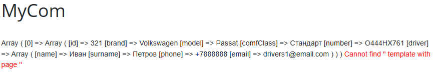
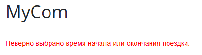

# Only Task demonstration 

Реализован вывод подходящих машин на указанное(сотрудником) время (через GET). Подбор машин учитывает должность сотрудника, а также "занятость" машины на указанное время.

- Результат вывода подходящих машин через print_r:

- Пример ошибки(не переданы даты):

